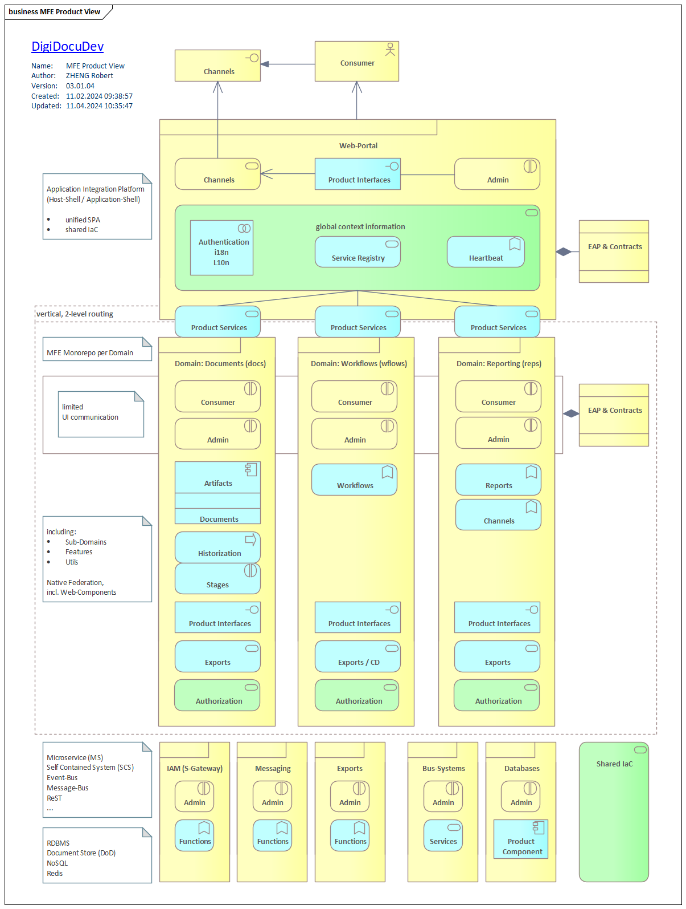
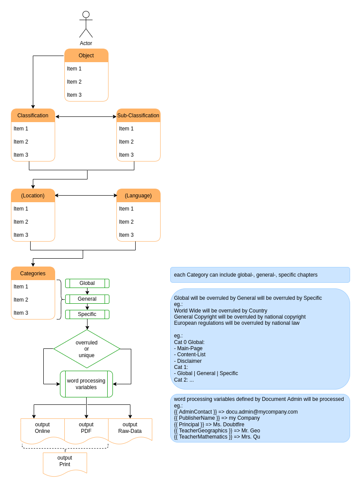

<div id="top" align="center">
<h1>DigiDocuDev</h1>

<p>Template for new Github repos</p>

[Report Issue](https://github.com/Zheng-Bote/repo-template/issues) [Request Feature](https://github.com/Zheng-Bote/repo-template/pulls)

[](https://choosealicense.com/licenses/mit/)


</div>

<hr>

<!-- START doctoc generated TOC please keep comment here to allow auto update -->
<!-- DON'T EDIT THIS SECTION, INSTEAD RE-RUN doctoc TO UPDATE -->

**Table of Contents**

- [Description](#description)
  - [Features](#features)
  - [Status](#status)
    - [Repo](#repo)
    - [Readme](#readme)
    - [Markdown files](#markdown-files)
- [Installation](#installation)
  - [Dependencies](#dependencies)
  - [folder structure](#folder-structure)
  - [Usage/Examples](#usageexamples)
- [API Reference](#api-reference)
  - [Inputs](#inputs)
  - [Outputs](#outputs)
  - [Parameters](#parameters)
- [Documentation](#documentation)
  - [Architecture](#architecture)
    - [Github](#github)
      - [Github Repo](#github-repo)
      - [Github Actions / Workflows](#github-actions--workflows)
  - [Application](#application)
  - [DevOps](#devops)
  - [Github Page](#github-page)
  - [Github Wiki](#github-wiki)
  - [Comments](#comments)
  - [Screenshots](#screenshots)
- [Authors and License](#authors-and-license)
  - [License](#license)
    - [MIT License](#mit-license)
    - [Apache License](#apache-license)
  - [Authors](#authors)
    - [Code Contributors](#code-contributors)

<!-- END doctoc generated TOC please keep comment here to allow auto update -->

<hr>

# Description


digidocu is a rich web application that can be used to create redundancy-free, multilingual documentation.

Optimized for maintenance of technical documentation

### Features

- \[x] Apache license v2.0
- \[x] works as designed
- \[ ] no bugs
- \[x] some more or less usefull Github Actions

<p align="right">(<a href="#top">back to top</a>)</p>

## Status

### Repo


### Readme

[](https://github.com/Zheng-Bote/digidocu_dev/actions/workflows/repo-create_tree_readme.yml)
[](https://github.com/Zheng-Bote/digidocu_dev/actions/workflows/repo-actions_docu.yml)

[](https://github.com/Zheng-Bote/digidocu_dev/actions/workflows/repo-call_Readme.yml)

### Markdown files

[](https://github.com/Zheng-Bote/digidocu_dev/actions/workflows/repo-create_doctoc_md.yml)

create ToC in Markdown files in folders

- .github/actions/\*\*
- .github/workflows/\*\*
- dist/\*\*
- docs/\*\*

<p align="right">(<a href="#top">back to top</a>)</p>

# Installation

bla bla ... everything easy and green with No Code/Low code and without any costs

## Dependencies

bla bla ... with a little help from my friends

## folder structure

<!-- readme-tree start -->

```
.
├── .github
│   ├── actions
│   │   └── doctoc
│   │       ├── README.md
│   │       ├── action.yml
│   │       └── dist
│   │           ├── index.js
│   │           ├── index.js.map
│   │           ├── licenses.txt
│   │           └── sourcemap-register.js
│   └── workflows
│       ├── repo-actions_docu.yml
│       ├── repo-call_Readme.yml
│       ├── repo-create_doctoc.yml_
│       ├── repo-create_doctoc_md.yml
│       └── repo-create_tree_readme.yml
├── LICENSE
├── LICENSE_Apache-2
├── LICENSE_GPL-2
├── LICENSE_GPL-3
├── LICENSE_MIT
├── README.md
└── tree.bak

5 directories, 18 files
```

<!-- readme-tree end -->

<p align="right">(<a href="#top">back to top</a>)</p>

## Usage/Examples

bla bla ... usage is intuitive and runs mostly automatically with no needs of any knowledge

```HTML
<mark> under construction </mark>
```

<p align="right">(<a href="#top">back to top</a>)</p>

# API Reference

<hr>


_Inputs/Outputs will be filled automatically by `.github/workflows/repo-actions_docu.yml`_

## Inputs

## Outputs

<hr>

<p align="right">(<a href="#top">back to top</a>)</p>

## Parameters

**Workflow or program**

| Parameter    | Type     | Description                          |
| :----------- | :------- | :----------------------------------- |
| `name`       | `string` | _Optional_ name-of-copyright-holder  |
| `created`    | `string` | _Optional_ <YYYY>                    |
| `version`    | `string` | _Optional_ \<v0.0.0>                 |
| `link_left`  | `string` | _Optional_ link-to-contact-page      |
| `link_right` | `string` | _Optional_ link-to-legal-notice-page |

<p align="right">(<a href="#top">back to top</a>)</p>

# Documentation

see also: [https://www.digidocu.dev/architecture_v3.html](https://www.digidocu.dev/architecture_v3.html)

## Architecture

## Application

### Product View



### Process



<p align="right">(<a href="#top">back to top</a>)</p>

## Comments

> \[!NOTE]
> Useful information that users should know, even when skimming content.

> \[!TIP]
> Helpful advice for doing things better or more easily.

> \[!IMPORTANT]
> Key information users need to know to achieve their goal.

> \[!WARNING]
> Urgent info that needs immediate user attention to avoid problems.

> \[!CAUTION]
> Advises about risks or negative outcomes of certain actions.

<p align="right">(<a href="#top">back to top</a>)</p>

## Screenshots


<p align="right">(<a href="#top">back to top</a>)</p>

# Authors and License

## License

[](<[https://choosealicense.com/licenses/mit/](http://www.apache.org/licenses/LICENSE-2.0)>)

Copyright (c) 2019 ZHENG Robert

Licensed under the **Apache License, Version 2.0** (the "License"); you may not use this file except in compliance with the License.

You may obtain a copy of the License at

       http://www.apache.org/licenses/LICENSE-2.0

Unless required by applicable law or agreed to in writing, software distributed under the License is distributed on an "AS IS" BASIS, WITHOUT WARRANTIES OR CONDITIONS OF ANY KIND, either express or implied.

See the License for the specific language governing permissions and limitations under the License.

## Authors

- [](https://www.github.com/Zheng-Bote)

### Code Contributors


[](https://www.github.com/Zheng-Bote)

<hr>

:vulcan_salute:

<p align="right">(<a href="#top">back to top</a>)</p>
